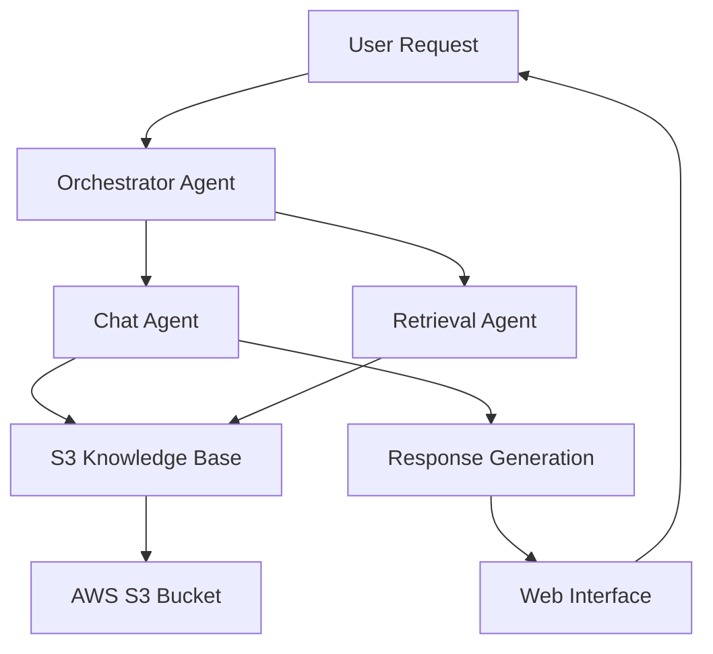

# Architecture Documentation - Royal Enfield S3 Chatbot

This document provides detailed technical architecture information for the Royal Enfield S3-based Knowledge Base Chatbot system.

## 🏗️ System Overview

The Royal Enfield S3 Chatbot is a **cloud-native, multi-agent system** built with the **Strands framework** that provides intelligent access to motorcycle manual information stored in **AWS S3**.

## 🤖 Multi-Agent Architecture

### Agent Hierarchy



### Agent Responsibilities

#### 1. Orchestrator Agent (`orchestrator_agent.py`)
- **Purpose**: Main request router and system coordinator
- **Responsibilities**:
  - Analyze incoming requests
  - Route to appropriate specialized agents
  - Handle agent communication
  - Manage system-level operations

**Key Tools:**
- `route_to_knowledge_base_manager`
- `route_to_retrieval_agent`
- `route_to_chat_agent`

#### 2. Retrieval Agent (`retrieval_agent.py`)
- **Purpose**: S3 data retrieval and search operations
- **Responsibilities**:
  - Search S3-stored knowledge base
  - Retrieve contextual information
  - Manage S3 health and status
  - Handle cache operations

**Key Tools:**
- `search_s3_knowledge_base`
- `get_contextual_information_s3`
- `search_by_section_s3`
- `search_by_page_s3`
- `get_s3_health_status`

#### 3. Chat Agent (`chat_agent.py`)
- **Purpose**: Conversational interface and response generation
- **Responsibilities**:
  - Process natural language queries
  - Generate contextual responses
  - Manage conversation history
  - Provide user assistance

**Key Tools:**
- `generate_response_with_context`
- `get_conversation_history`
- `suggest_related_questions`
- `analyze_query_intent`

## ☁️ S3 Data Architecture

### S3 Bucket Structure

```
s3://your-bucket-name/
├── processed/
│   ├── chunks/                    # Text chunks (JSON format)
│   │   ├── royal-enfield-meteor-manual_chunk_001.json
│   │   ├── royal-enfield-meteor-manual_chunk_002.json
│   │   └── ...
│   └── metadata/                  # Document metadata
│       └── document_metadata.json
├── documents/                     # Original files (optional)
│   └── royal-enfield-meteor-manual.pdf
└── indexes/                       # Search indexes (optional)
    └── search_index.json
```

### Data Models

#### Chunk Data Model
```json
{
    "chunk_id": "royal-enfield-meteor-manual_chunk_001",
    "content": "Engine oil change procedure...",
    "metadata": {
        "document_name": "royal-enfield-meteor-manual",
        "section": "Maintenance and Service",
        "page_numbers": [45, 46],
        "chunk_index": 0,
        "word_count": 150,
        "char_count": 800,
        "topics": ["oil", "maintenance", "engine"],
        "chunk_type": "maintenance",
        "created_at": "2024-01-01T12:00:00"
    }
}
```

#### Document Metadata Model
```json
{
    "document_name": "Royal Enfield Meteor Owner's Manual",
    "processed_at": "2024-01-01T12:00:00",
    "total_pages": 120,
    "total_sections": 15,
    "total_chunks": 85,
    "total_words": 25000,
    "source_file": "royal-enfield-meteor-manual.pdf"
}
```

## 🔍 Search and Retrieval System

### Search Algorithm

The system uses a **multi-factor relevance scoring** algorithm:

1. **Term Frequency**: Count of query terms in content
2. **Phrase Matching**: Bonus for exact phrase matches
3. **Position Scoring**: Earlier occurrences score higher
4. **Metadata Matching**: Section and topic relevance
5. **Content Type Scoring**: Match query intent with content type

### Relevance Scoring Formula

```python
score = (
    term_frequency_score * 0.4 +
    phrase_match_score * 0.3 +
    position_score * 0.15 +
    metadata_score * 0.15
)
```

### Caching Strategy

- **5-minute cache** for S3 chunk data
- **Automatic cache invalidation** on data updates
- **Manual cache refresh** via web interface
- **Memory-efficient** caching with timestamp validation

## 🌐 Web Interface Architecture

### Flask Application Structure

```
web/
├── app.py                 # Main Flask application
└── templates/
    └── index.html         # Single-page chat interface
```

### API Endpoints

- **`GET /`**: Main chat interface
- **`POST /chat`**: Handle chat messages
- **`POST /refresh-kb`**: Refresh S3 cache
- **`GET /status`**: System status
- **`POST /clear-history`**: Clear conversation history

### Frontend Features

- **Real-time messaging** with WebSocket-like experience
- **Responsive design** for mobile and desktop
- **Loading indicators** and typing animations
- **Error handling** with user-friendly messages
- **Quick action buttons** for common queries

## 🔧 Configuration System

### Environment-Based Configuration

The system uses a centralized configuration approach:

```python
# config/settings.py
class Config:
    # AWS Configuration
    AWS_ACCESS_KEY_ID = os.getenv('AWS_ACCESS_KEY_ID')
    AWS_SECRET_ACCESS_KEY = os.getenv('AWS_SECRET_ACCESS_KEY')
    AWS_REGION = os.getenv('AWS_REGION', 'us-east-1')
    S3_BUCKET_NAME = os.getenv('S3_BUCKET_NAME')
    
    # Model Configuration
    MODEL_ID = os.getenv('MODEL_ID', 'amazon.nova-micro-v1:0')
    MODEL_TEMPERATURE = float(os.getenv('MODEL_TEMPERATURE', '0.7'))
    
    # Application Configuration
    SECRET_KEY = os.getenv('SECRET_KEY')
    FLASK_DEBUG = os.getenv('FLASK_DEBUG', 'True').lower() == 'true'
```

### Configuration Validation

The system validates all required configuration on startup:

```python
@classmethod
def validate_config(cls):
    required_vars = [
        'AWS_ACCESS_KEY_ID',
        'AWS_SECRET_ACCESS_KEY',
        'S3_BUCKET_NAME'
    ]
    # Validation logic...
```

## 📊 Monitoring and Logging

### Logging Strategy

- **Structured logging** with different levels
- **Component-specific loggers** for each module
- **S3 operation logging** for debugging
- **User interaction logging** for analytics

### Health Monitoring

The system provides comprehensive health monitoring:

1. **S3 Connection Status**
2. **Bucket Accessibility**
3. **Data Availability**
4. **Permission Validation**
5. **Cache Performance**
6. **Agent Response Times**

## 🔐 Security Architecture

### AWS Security

- **IAM-based access control** with minimal permissions
- **Environment variable** credential storage
- **No hardcoded credentials** in source code
- **S3 bucket policies** for additional security

### Application Security

- **Input validation** for all user inputs
- **Session management** with secure cookies
- **Error handling** without information disclosure
- **Rate limiting** considerations for production

## ⚡ Performance Optimization

### S3 Optimization

- **Smart caching** with TTL-based invalidation
- **Batch operations** for multiple S3 requests
- **Connection pooling** for S3 client
- **Retry logic** with exponential backoff

### Search Optimization

- **Relevance scoring** to return best matches first
- **Result limiting** to prevent large responses
- **Query preprocessing** for better matching
- **Section-based filtering** for targeted searches

### Memory Management

- **Lazy loading** of S3 data
- **Cache size limits** to prevent memory issues
- **Garbage collection** of expired cache entries
- **Efficient JSON parsing** for large chunks

## 🔄 Data Flow

### Request Processing Flow

1. **User Input** → Web Interface
2. **HTTP Request** → Flask App
3. **Agent Routing** → Orchestrator Agent
4. **Specialized Processing** → Chat/Retrieval Agent
5. **S3 Data Retrieval** → S3 Knowledge Base
6. **Response Generation** → Chat Agent
7. **Formatted Response** → Web Interface
8. **Display** → User

### S3 Data Flow

1. **S3 Connection** → Validate credentials and bucket access
2. **Data Discovery** → List available chunks and metadata
3. **Content Retrieval** → Download relevant chunks
4. **Caching** → Store in memory for faster access
5. **Search Processing** → Apply relevance scoring
6. **Context Aggregation** → Combine multiple chunks
7. **Response Preparation** → Format for chat agent

## 🛠️ Extension Points

### Adding New Agents

```python
# Create new agent
new_agent = Agent(
    system_prompt="Your specialized prompt",
    model=model,
    tools=[your_custom_tools],
    name="New Agent",
    description="Agent description"
)

# Add routing in orchestrator
@tool
def route_to_new_agent(request: str) -> str:
    response = new_agent(request)
    return str(response)
```

### Adding New Tools

```python
@tool
def your_custom_tool(param: str) -> str:
    """
    Your custom tool description
    
    Args:
        param: Parameter description
        
    Returns:
        str: Tool result
    """
    # Your implementation
    return result
```

### Extending S3 Operations

```python
# Add to S3OnlyKnowledgeBase class
def your_custom_s3_operation(self, param: str) -> Any:
    """Custom S3 operation"""
    # Use self.storage_manager for S3 operations
    return result
```

## 📈 Scalability Considerations

### Horizontal Scaling

- **Multiple instances** can share the same S3 data
- **Load balancing** across multiple Flask instances
- **Session affinity** not required (stateless design)
- **Cache coordination** across instances

### Vertical Scaling

- **Memory scaling** for larger knowledge bases
- **CPU scaling** for concurrent user handling
- **Network optimization** for S3 throughput
- **Cache sizing** based on available memory

### AWS Scaling

- **S3 auto-scaling** handles storage growth
- **Bedrock scaling** managed by AWS
- **Multi-region deployment** for global access
- **CDN integration** for static assets

## 🔮 Future Enhancements

### Potential Improvements

1. **Vector Search**: Implement embedding-based semantic search
2. **Multi-Document**: Support multiple motorcycle manuals
3. **Real-time Updates**: WebSocket for live chat updates
4. **Advanced Analytics**: User query analytics and insights
5. **Mobile App**: Native mobile application
6. **Voice Interface**: Voice-based queries and responses

### Integration Opportunities

- **AWS Lambda**: Serverless deployment
- **Amazon OpenSearch**: Advanced search capabilities
- **Amazon DynamoDB**: Session and user data storage
- **Amazon CloudFront**: Global content delivery
- **AWS API Gateway**: RESTful API exposure

---

This architecture provides a **robust, scalable, and maintainable** foundation for S3-based knowledge base chatbots using the Strands framework.